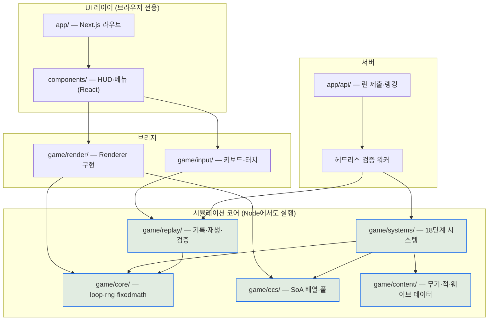
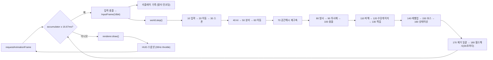
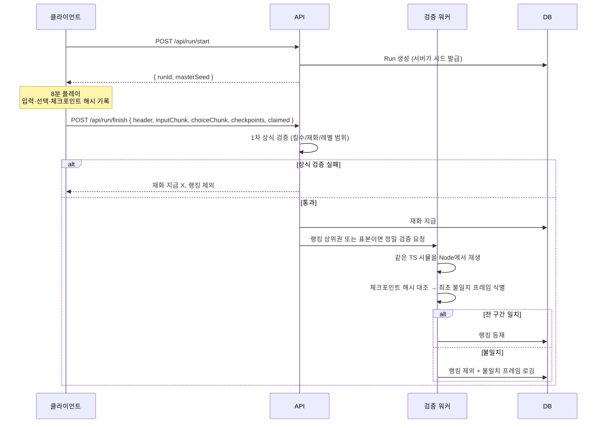
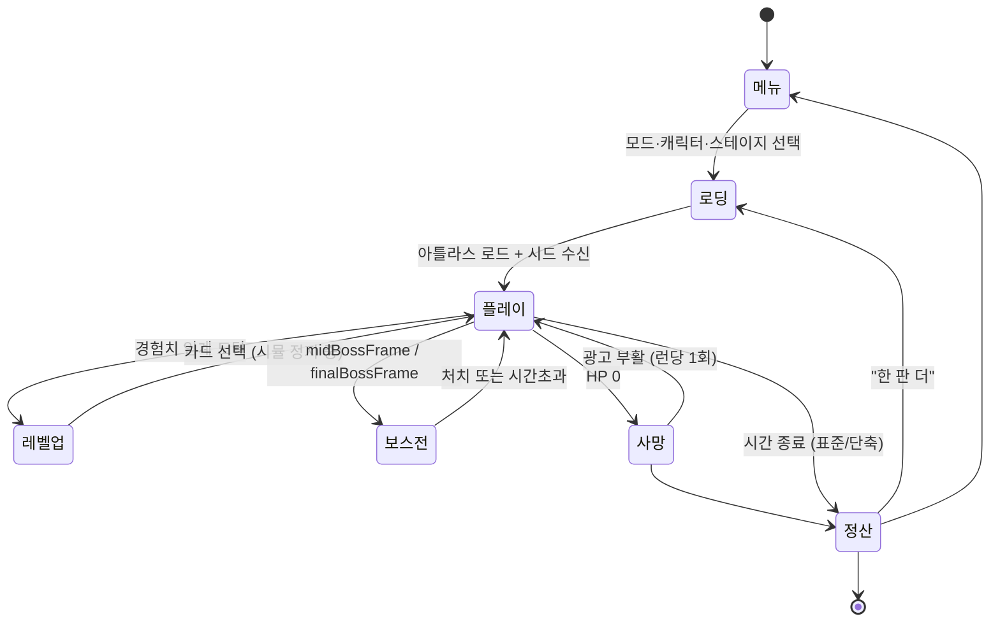

# 야근 서바이버즈 — 프로젝트 셋업 & 아키텍처

| 항목 | 내용 |
|---|---|
| 문서 버전 | v0.1 |
| 작성일 | 2026-08-20 |
| 상위 문서 | PRD v0.2, TDD v0.1 |
| 목적 | 첫 커밋 전에 확정해야 하는 저장소·툴체인·CI 결정과, 시스템 전체 구조의 시각화 |

---

## 1. 저장소

**결정: 신규 독립 레포** (PRD §15-I)

| 항목 | 값 |
|---|---|
| 레포명 | `overtime-survivors` |
| 가시성 | private (베타 전까지) |
| 기본 브랜치 | `main` |
| 패키지 매니저 | pnpm |
| 워크스페이스 | 사용하지 않음 (단일 앱) |

기존 `loterry-playground` 워크스페이스에 넣지 않는 이유는, 배포 파이프라인·CI 실행 시간·의존성 트리가 섞이면 게임 쪽 빌드 최적화(번들 1.5MB 예산, PRD §9.4)를 관리하기 어려워지기 때문이다. 나중에 공개하거나 이관할 때도 독립 레포가 깔끔하다.

---

## 2. 툴체인

| 레이어 | 선택 | 비고 |
|---|---|---|
| 런타임 | Node 22 LTS | `.nvmrc`로 고정 |
| 프레임워크 | Next.js (App Router) | |
| 언어 | TypeScript strict | `noUncheckedIndexedAccess` **켬** (아래 결정 번복 참조) |
| 린트 | ESLint flat config | TDD §1.5 규약 강제가 주 목적 |
| 포맷 | Prettier | |
| 테스트 | Vitest | 결정론·골든 리플레이·단위 |
| E2E/성능 | Playwright | 벤치 자동화, 헤드리스 회귀 |
| DB | Prisma + PostgreSQL | M4부터 |
| 아트 | Aseprite CLI + ImageMagick | 빌드 스텝 통합 |
| 배포 | Vercel | |

### 2.1 tsconfig 핵심

```jsonc
{
  "compilerOptions": {
    "target": "ES2022",
    "module": "esnext",
    "moduleResolution": "bundler",
    "strict": true,
    "noUncheckedIndexedAccess": true,    // 아래 결정 번복 참조
    "noImplicitOverride": true,
    "exactOptionalPropertyTypes": true,
    "verbatimModuleSyntax": true,
    "paths": { "@game/*": ["./game/*"], "@/*": ["./*"] }
  }
}
```

> **결정 번복 (M1 스캐폴딩 중).** 초안에서는 핫 패스가 지저분해진다는 이유로 이 옵션을 끄기로 했으나, 실제로 짜 보니 SoA 배열 접근에 `!`를 붙이는 비용이 예상보다 작았다 — 전부 `w.eX[i]!` 형태로 기계적이다. 대신 오프바이원과 풀 경계 실수를 컴파일 타임에 잡아준다. 스캐폴딩 전체가 이 설정으로 타입체크를 통과했으므로 켠 채로 간다.

### 2.2 ESLint — 규약을 코드로 강제

문서로만 둔 규약은 3주 뒤에 깨진다. TDD §1.5와 §3.1을 린트로 못 박는다.

```js
// eslint.config.mjs (발췌)
export default [
  // 게임 시뮬레이션 코어: 결정론 규약
  {
    files: ['game/{core,ecs,systems,content,replay}/**/*.ts'],
    rules: {
      'no-restricted-globals': ['error',
        { name: 'Date', message: 'TDD §1.1 — 프레임 카운터를 쓸 것' },
        { name: 'performance', message: 'TDD §1.1' },
        { name: 'window', message: 'TDD §3.1 — Node에서도 실행되어야 함' },
        { name: 'document', message: 'TDD §3.1' },
      ],
      'no-restricted-properties': ['error',
        { object: 'Math', property: 'random', message: 'rng.next(RngStream.X)' },
        { object: 'Math', property: 'sin',   message: 'fixedmath.dSin' },
        { object: 'Math', property: 'cos',   message: 'fixedmath.dCos' },
        { object: 'Math', property: 'tan',   message: 'fixedmath' },
        { object: 'Math', property: 'atan2', message: 'fixedmath.dAtan2' },
        { object: 'Math', property: 'hypot', message: 'fixedmath.dLen' },
        { object: 'Math', property: 'pow',   message: 'fixedmath.dPow' },
        { object: 'Math', property: 'exp',   message: 'fixedmath' },
        { object: 'Math', property: 'log',   message: 'fixedmath' },
      ],
      'no-restricted-syntax': ['error',
        { selector: 'ForInStatement', message: 'TDD §1.4 — 순서 비보장' },
      ],
      'import/no-restricted-paths': ['error', {
        zones: [{
          target: './game/{core,ecs,systems,content,replay}',
          from: ['./components', './app', './lib'],
          message: 'TDD §3.1 — 시뮬 코어는 UI를 모른다',
        }],
      }],
      'no-restricted-imports': ['error', { patterns: ['react', 'react-dom', 'next/*'] }],
    },
  },
  // 렌더러 구현체는 DOM을 쓴다 — 위 제약에서 제외
  { files: ['game/render/**/*.ts'], rules: { 'no-restricted-globals': 'off' } },
];
```

> `fixedmath.ts` 자신은 `Math.sin`으로 테이블을 생성해야 하므로 파일 상단에 `/* eslint-disable no-restricted-properties */`를 둔다. 예외를 한 파일로 가두는 것이 규약의 요점이다.

### 2.3 package.json 스크립트

```jsonc
{
  "scripts": {
    "dev": "next dev",
    "build": "pnpm art:build && next build",
    "lint": "eslint . && tsc --noEmit",
    "test": "vitest run",
    "test:determinism": "vitest run tests/determinism",
    "test:golden": "vitest run tests/golden",
    "bench": "node tools/bench-headless.mjs",
    "sim": "tsx tools/balance-sim.ts --runs 1000",
    "art:normalize": "tsx tools/sprite-normalize.ts",
    "art:validate": "tsx tools/sprite-validate.ts",
    "art:build": "tsx tools/atlas-build.ts",
    "content:validate": "tsx tools/content-validate.ts"
  }
}
```

---

## 3. CI 파이프라인

```yaml
# .github/workflows/ci.yml (구조)
jobs:
  quality:
    - pnpm lint                 # 타입 + 결정론 규약
    - pnpm content:validate     # 콘텐츠 참조 무결성 (schema.ts §14)
    - pnpm art:validate         # 팔레트 이탈·반투명·규격 (PRD §6.4)
    - pnpm test                 # 단위 + 결정론 + 골든 리플레이
  bench:
    - pnpm bench                # 헤드리스 로직 성능 회귀 (임계 초과 시 실패)
```

**핵심은 `art:validate`와 `test:determinism`이 CI에 있다는 것이다.** 둘 다 "사람이 조심하면 되는 일"처럼 보이지만, 실제로는 사람이 반드시 놓치는 일이다. 에셋 200장이 쌓인 뒤 팔레트 이탈을 발견하면 전량 재작업이고, 결정론이 언제 깨졌는지 모르면 리플레이 검증 기능 자체가 무너진다.

---

## 4. 브랜치 · 커밋 규약

1인 개발이므로 최소한만 둔다.

- **브랜치:** `main` 직접 커밋 허용. 실험적 작업만 `spike/<주제>`.
- **커밋:** Conventional Commits. `feat(weapon):`, `fix(collision):`, `perf(render):`, `content(balance):`, `art(sprite):`
- **`engineVersion` bump:** 시뮬 로직(`game/core`, `game/ecs`, `game/systems`)이 바뀌면 커밋에 `BREAKING-SIM:` 트레일러를 달고 버전을 올린다. 골든 리플레이 갱신도 같은 커밋에서 한다. (TDD 미결 T5의 잠정 답 — 수동 bump)
- **태그:** 마일스톤마다 `m0`, `m1` … 성능 회귀 추적의 기준점.

---

## 5. 아키텍처 다이어그램

### 5.1 모듈 의존 방향



파란 블록이 **React·DOM을 절대 import하지 않는 구역**이다. 이 경계가 지켜져야 서버 검증 워커가 같은 코드를 그대로 실행할 수 있다.

### 5.2 한 프레임의 데이터 흐름



`world.step()`이 dt를 받지 않는다는 점, 그리고 공간 해시 재구축(70)이 이동(60)과 충돌(100) **사이**에 있다는 점이 이 그림의 요점이다.

### 5.3 리플레이 검증 시퀀스



체크포인트 해시가 있어야 "어디서 갈라졌는지"를 알 수 있다. 최종 결과만 비교하면 조작인지 엔진 버그인지 구분이 안 된다.

### 5.4 런 상태 머신



`정산 → 로딩` 화살표가 이 게임의 생명선이다. 8분 런의 가치는 회전율에 있고, 회전율은 이 전이의 마찰에서 결정된다 (PRD §3.2).

---

## 6. 초기 스캐폴딩 순서

M1 착수 시 이 순서로 만든다. 각 단계는 다음 단계의 전제다.

| # | 작업 | 산출물 |
|---|---|---|
| 1 | 레포 생성, Next.js + TS + pnpm 초기화 | 빈 앱이 뜬다 |
| 2 | ESLint 규약 설정 (§2.2) | 위반 코드가 커밋 전에 막힌다 |
| 3 | `game/core/fixedmath.ts` + `rng.ts` | 결정론의 토대 |
| 4 | `game/core/constants.ts` (§TDD 2 좌표계) | 매직 넘버 제거 |
| 5 | `game/ecs/components.ts` (SoA 배열, 풀) | |
| 6 | `game/render/Renderer.ts` 인터페이스 + Canvas2D 구현 | |
| 7 | `game/core/loop.ts` (고정 타임스텝) | 빈 월드가 60FPS로 돈다 |
| 8 | `game/systems/` 최소 3종 (입력·이동·렌더) | 조작 가능한 사각형 |
| 9 | `tests/determinism.test.ts` | **여기서 결정론을 못 박는다** |
| 10 | 콘텐츠 스키마 배선 + 첫 무기 1종 | 게임의 씨앗 |

9번을 뒤로 미루면 안 된다. 시스템이 5개일 때 결정론을 확보하는 것과 20개일 때 확보하는 것은 난이도가 다르다.

---

## 7. 남은 결정

| # | 항목 | 시점 |
|---|---|---|
| S1 | Vercel 프로젝트·도메인 | M4 |
| S2 | 에러 추적 (Sentry 등) 도입 여부 | M5 |
| S3 | 계측 백엔드 (자체 API vs 외부 SaaS) | M5 |
| S4 | 서버 검증 워커 실행 환경 (TDD T4) | M6 |
